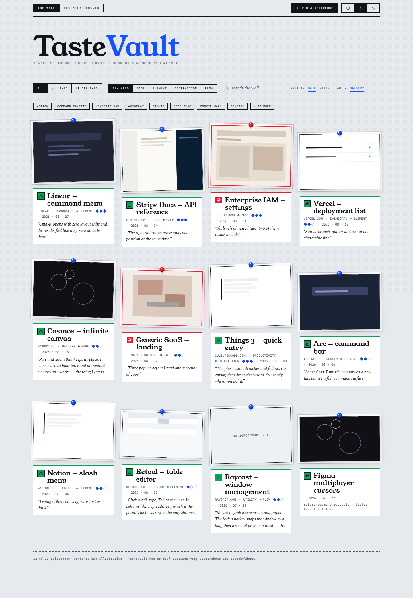
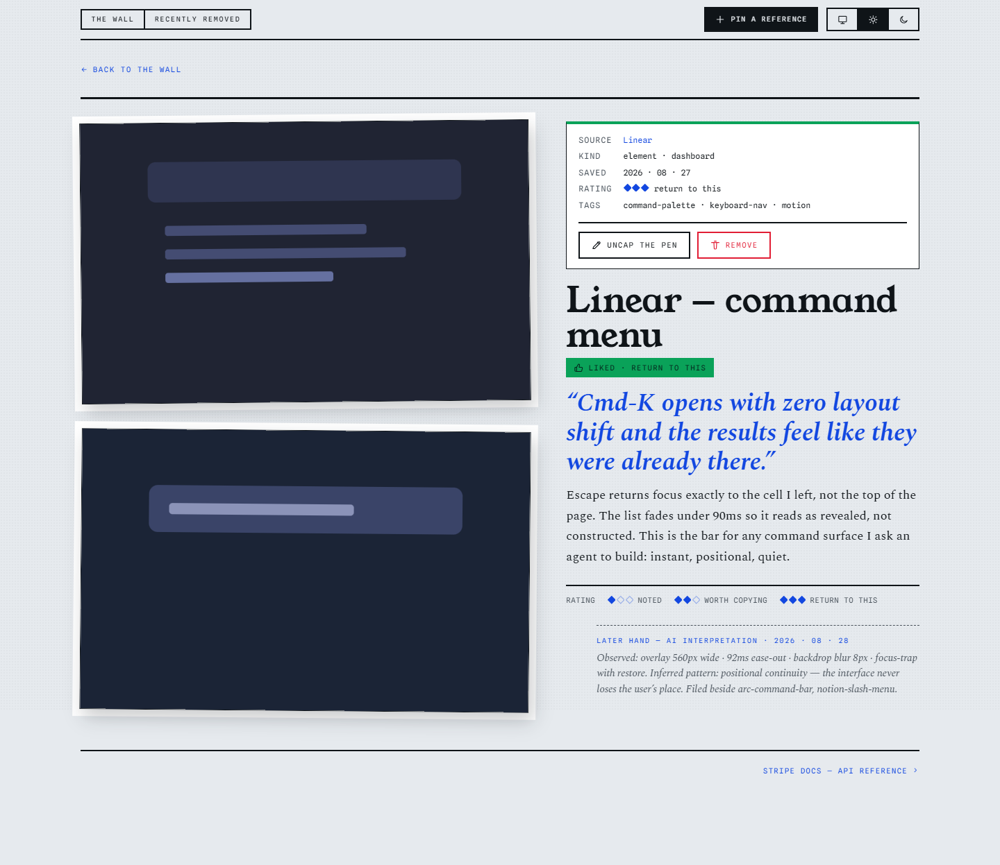

<div align="center">

<h1>TasteVault</h1>

<p><b>A local-first vault for the web design you've judged — the good and the bad,<br>with your reasons kept intact, on a wall you can browse.</b></p>

<picture>
  <source media="(prefers-color-scheme: dark)" srcset="docs/media/portal-wall-dark.png">
  
</picture>

<p><sub><i>The Portal, populated. Everything above is an illustrative mockup — your Vault starts empty and fills as you save.</i></sub></p>

<p>
  <a href="#getting-started">Getting started</a> &nbsp;·&nbsp;
  <a href="#how-it-works">How it works</a> &nbsp;·&nbsp;
  <a href="#architecture">Architecture</a> &nbsp;·&nbsp;
  <a href="#where-this-is-going">Roadmap</a>
</p>

</div>

---

TasteVault sits between the web and an AI coding agent. You save the pages,
components, and interactions you've decided are good — and the ones you've
decided are bad — with the evidence intact and a note in your own words on why.
You browse that collection through the **Portal**. Later, a retrieval layer feeds
your agent the few relevant examples, and the relevant guard rails, before it
designs anything.

> It preserves the dimensions a screenshot loses, keeps your reasoning as ground
> truth, and hands your agent a small high-signal set — never the whole library.

Four commitments set the shape of the project:

- **Your reasoning is the point.** Every Reference carries a *User Note* — plain
  prose on *why* you saved it. It stays the ground truth; anything an AI later
  derives is stored separately and marked as derived, so an early mistake can
  never overwrite what you captured.
- **Taste has two poles.** What you want to *avoid* is saved exactly like what
  you want to emulate — one optional `sentiment: negative` field — and carried
  through every phase as a guard rail for the agent.
- **Retrieval, not generation.** TasteVault never produces an interface. It feeds
  a small, relevant, high-signal set to whoever is designing — you, or your
  agent — and never the whole Vault.
- **More than a screenshot.** A still image is one kind of evidence; the roadmap
  adds interactions, transitions, motion, and responsive behaviour as
  first-class captures.

<div align="center">
<br>
<picture>
  
</picture>
<p><sub><i>One Reference open — the note you wrote is the centrepiece; the AI's later reading sits under it, dated and dimmed.</i></sub></p>
</div>

---

## How it works

Your **Vault** is the `references/` directory on your machine. Its contents are
git-ignored — nothing is uploaded anywhere. A **Reference** is one folder inside
it:

```
references/
└── stripe-command-palette-2026-08-29/
    ├── reference.md      # optional — YAML frontmatter + your note
    ├── cover.png         # optional — the grid thumbnail
    └── full.png          # any other images, shown sorted by filename
```

`reference.md` is YAML frontmatter followed by a Markdown body; the body is your
User Note. **Every field is optional, and so is the whole file.** A folder with a
single screenshot and nothing else is a valid Reference.

Nothing is validated. A missing file, unparseable YAML, a typo, a folder with no
images — the Portal lists it anyway and fills every gap from the folder name and
the file dates. Metadata is enrichment, never a contract. This is a deliberate
stance, recorded in
[`docs/adr/0001-references-degrade-gracefully.md`](docs/adr/0001-references-degrade-gracefully.md).

---

## Getting started

Requires **Node 22** and **pnpm 11**.

```bash
git clone https://github.com/mdsdqk/taste-vault
cd taste-vault
pnpm install
```

Then, from the repo root:

| Command | What it does |
| --- | --- |
| <kbd>pnpm start</kbd> | Build the Portal and serve it with the API on <samp>http://localhost:5174</samp> — the everyday mode. |
| <kbd>pnpm dev</kbd> | Run the server (`:5174`) and the Portal with HMR (`:5173`) side by side. |
| <kbd>pnpm new-ref</kbd> | Scaffold a well-formed Reference folder. Every prompt is optional; a convenience, never a gate. |
| <kbd>pnpm typecheck</kbd> | Type-check every workspace package. |

Add your first Reference with `pnpm new-ref`, by dropping a folder into
`references/` by hand, or in place from the Portal's detail view. The server
watches the Vault, so it shows up immediately. With nothing saved yet, the Portal
opens on its first-run state rather than an error.

The full authoring guide — folder shape, every frontmatter field, how to save a
negative Reference — lives in [`references/readme.md`](references/readme.md).

---

## Architecture

A pnpm workspace under `apps/*`. TasteVault is two processes with the Vault
between them.

**`apps/server`** — Fastify + TypeScript. Scans and watches `references/`, parses
frontmatter, renders each User Note to sanitised HTML, and serves a JSON API plus
the raw asset files. Edits made in the Portal are written back to disk in the
same on-disk format `pnpm new-ref` produces. A Server-Sent Events stream
(`GET /api/events`) emits a message on every change, so the Portal live-updates
as folders come and go. Endpoints and configuration:
[`apps/server/README.md`](apps/server/README.md).

**`apps/web`** — Vite + React + TypeScript, Tailwind + Radix, self-hosted fonts.
Two views: the **Library** — a gallery wall of screenshot plates hung by rating,
with a filter/sort band and tag facets — and **Reference detail**, where the User
Note is set large next to the identity fields. Client-side fuzzy search runs over
title, tags, and note text. More: [`apps/web/README.md`](apps/web/README.md); the
visual system is documented in [`DESIGN.md`](DESIGN.md).

The shared vocabulary — Reference, Sentiment, Vault, Portal, Evidence, User
Note — is fixed in [`CONTEXT.md`](CONTEXT.md). The full product spec is
[`docs/PRD.md`](docs/PRD.md).

---

## Where this is going

Phase 1 — the manual library described above — is what's built today. The
[roadmap](docs/ROADMAP.md) continues:

- **Phase 2 — Browser capture.** An extension (`apps/extension`, scaffolded, not
  yet built) that saves the current page and asks what you liked about it,
  writing into the same `references/` store the Portal already reads.
- **Phase 3 — Focused & interactive capture.** Save one element in isolation;
  record `before → action → after` for hovers, menus, and modals; then
  animations, transitions, and multi-step flows.
- **Phase 4 — AI analysis.** Derive observations, vocabulary, and a short
  "why this matters" note per Reference — always separate from the evidence,
  always marked as derived. Negative References yield anti-patterns from the same
  machinery.
- **Phase 5 — Retrieval & MCP.** Lexical, semantic, and preference-aware
  retrieval behind an MCP server, so Claude Code can ask for the references
  relevant to what it's designing and get back a small, high-quality set — guard
  rails included.
- **Phase 6 — Agent augmentation & self-hosting.** Retrieval wired into the
  design workflow; single-command containerisation; remote storage for
  multi-device use.

Each phase has to prove useful before the next begins.

---

## License

[MIT](LICENSE). The application, the future extension, and the future MCP server
are open source. Your Vault is yours and never leaves your machine.
